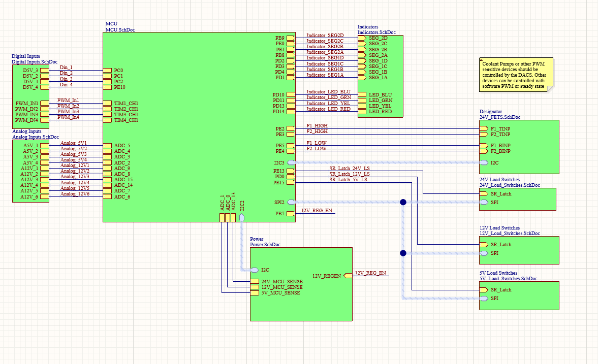

## Introduction
As the Queen's Formula SAE team continues to transition from internal combustion to electric, one of the most important components to consider is the Vehicle Control Unit, or VCU.
The VCU sits at the heart of the car, responsible for everything from controlling the motor power and throttle control signals down to the coolant system and brake light.

### Internal Combustion
In previous internal combustion cars, the control of the car was split up into two primary control units. The ECU, or engine control unit, interfaced with the sensors and throttle control. The ECU was responsible for all high speed computations and communications including engine timing, shifting, fuel injection and ignition control.
The PDM, or Power Distribution Module, was responsible for controlling power flow throughout the car. With the exception of the starter motor, every electronic device on the car was fed power from one of the PDM's load switches.

### Electric VCU
Upon moving to an electric vehicle, the decision was made to consolidate the ECU and PDM into a single control unit: The VCU. This decision was the result of the IC ECU having to manage and control a large variety of sensors and perform a significant amount of calculations to control the IC engine.
However, inside of an electric vehicle, nearly all of the motor control is delegated out to the inverter. Additionally, accumulator (battery) management must be able to take place outside the car, and is largely completed by the BMS (Battery Management System).
This leaves only two primary responsibilities left over for the VCU: Power Management and Throttle Control.
While this could have been separated into two distinct control boards, the intercommunication required would significantly increase the technical complexity of both boards involved. Thus, the decision was made to use a single board for both tasks.
This board was given the designation of Vehicle Control Unit, and its design is outlined below.

## Schematic Design
Utilizing the old IC wiring harness and the EV block diagram as a guide, the schematic design for the VCU was completed. Before starting, the following basic features that must be present in the board were outlined:
- 24V Compatible
- 24V Load Switches (x8)
	- Inverters
	- BMS
	- Dashboard
- 12V High Current Rail
	- 6 12V Load Switches for legacy 12V sensors and devices such as the transponder
- 5V Rail
	- 6 5V Load Switches for sensors and BSPD
- Analog Inputs
	- Throttle Pedals (5V)
	- Brake Pressure Sensors (12V)
	- Steering Angle Sensor
- PWM Decoding for Wheel Speed Inputs
- CAN Bus Communication
- UART Communication for Debugging
- General Purpose Digital Inputs for buttons
- Indication LEDs for Debugging

### Top
The top schematic file, shown below, contains all of the interlinks between the individual schematic documents.

Inputs, both analog and digital, are placed on the left while outputs such as the indicators and load switches are placed on the right.
Signal harnesses are used for SPI and I2C to simplify schematic wiring. The I2C signal harness contains the SDA and SCL wires while the SPI signal harness contains the clock, master, and slave transmission signals. 

The schematic labeling convention for inputs is the same as the the external labeling. The labeling present on the MCU schematic is the same as the labeling within the MCU datasheet. External labeling conventions were used in this way such that a programmer can gain nearly all required information about the board simply by looking at the top level schematic.

### MCU
The MCU schematic contains the STM32F446 Microcontroller that runs the VCU. Given the teams history using the F446 Series, the 100 pin variant was chosen for this design. Utilizing the same chip variant for all designs allows for higher transferability of low level code and easier debugging given the team is already familiar with the chipset.

The MCU schematic document also contains two sub schematics for CAN and an I2C based EEPROM. The CAN Schematic has been included below.

The CAN schematic contains a dip switch for enabling the optional termination resistors. Note that 3.3V CAN transceivers are used allow debugging of the CAN bus while the board is powered off of the 3.3V rail provided by the debugger.
### Power Management
As previously mentioned, power management is one of the main responsibilities of the VCU. The VCU contains 24V, 12V and 5V rails, all of which are externally accessible through load switched outputs. While each buck converter is designed to handle up to 20A, with the board being designed to draw up to 80A from the power input, it is highly unlikely that this power draw will ever be reached.
#### Board Power
The board power schematic is the top level schematic equivalent for power distribution. Shown below, the schematic contains the screw terminals used for providing power to the board, the automotive fuses, and INA219 current sensors.

On the bottom left of the schematic, voltage dividers are used to provide feedback to the MCU's ADC. This allows the software to check if each of the voltage rails are running as expected.

On the right side of the schematic, the voltage regulators are shown. Both regulators are fed from the 24V rail and use a buck switching topology designed using the TI WebBench tool. Fuses are placed on both sides of the buck converters. This ensures that the regulators will never be overdrawn, or overdraw from board power themselves. Placing fuses on both sides also allows the ability to safely check regulator operation and back power each voltage rail during testing.
#### Load Switching

Nealy all 

### Inputs and Outputs (IO)

#### Analog

#### Digital

#### Indication and Debug

## PCB Design

### Layout

### Routing

## Board Viewer

## Conclusion
