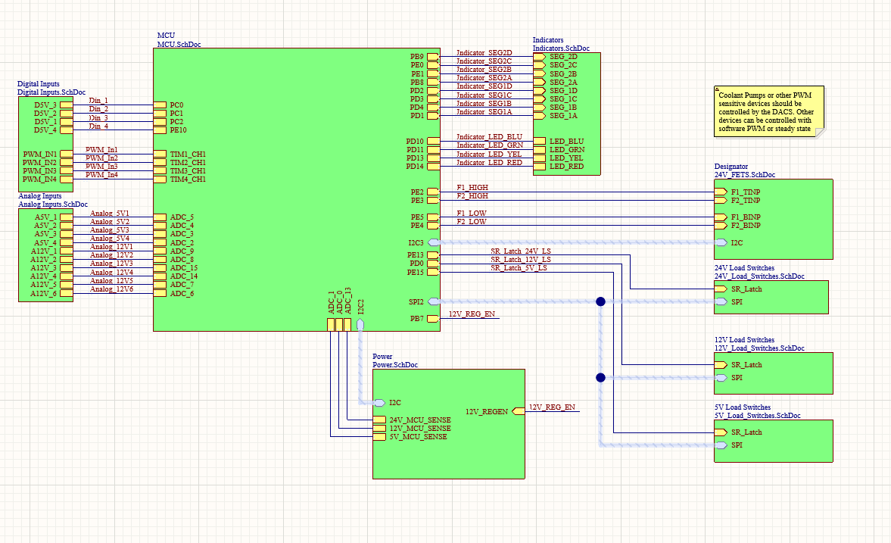

## Introduction
As the Queen's Formula SAE team continues to transition from internal combustion to electric, one of the most important components to consider is the Vehicle Control Unit, or VCU.
The VCU sits at the heart of the car, responsible for everything from controlling the motor power and throttle control signals down to the coolant system and brake light.

### Internal Combustion
In previous years internal combustion cars, the control of the car was split up into two primary control units. The ECU, or engine control unit, interfaced with engine sensors and actuators. The ECU was responsible for all high speed computations and communications including engine timing, shifting, fuel injection and ignition control.
The other primary control unit is the PDM, or Power Distribution Module. The PDM was responsible for controlling power flow throughout the car. With the exception of the starter motor, every electronic device on the car was fed power from one of the PDM's load switches.

### Electric VCU
Upon moving to an electric vehicle, the decision was made to consolidate the ECU and PDM into a single control unit: The VCU.
This decision was the result of the IC ECU having to manage and control a large variety of sensors and perform a significant amount of calculations to control the IC engine.
However, inside of an electric vehicle, nearly all of the motor control is delegated out to the inverter.
Additionally, accumulator (battery) and its monitoring systems must be fully self contained, and is largely fulfilled by the BMS (Battery Management System).
This leaves only two primary responsibilities left over for the VCU: Power Management and Throttle Control.
While this could have been separated into two distinct control boards, the intercommunication required would significantly increase the technical complexity of both boards involved. Thus, the decision was made to use a single board for both tasks.
This board was given the designation of Vehicle Control Unit, and its design is outlined below.

## Schematic Design
Utilizing the old IC wiring harness and the EV block diagram as a guide, the schematic design for the VCU was completed. Before starting, the following basic features that must be present in the board were outlined:
- 24V Compatible
- 24V Load Switches (x8)
	- Inverters
	- BMS
	- Dashboard
- 12V High Current Rail
	- 6 12V Load Switches for legacy 12V sensors and devices such as the transponder
- 5V Rail
	- 6 5V Load Switches for sensors and BSPD
- Analog Inputs
	- Throttle Pedals (5V)
	- Brake Pressure Sensors (12V)
	- Steering Angle Sensor
- PWM Decoding for Wheel Speed Inputs
- CAN Bus Communication
- UART Communication for Debugging
- General Purpose Digital Inputs for buttons
- Indication LEDs for Debugging

### Top
The top schematic file, shown below, contains all of the interlinks between the individual schematic documents.

Inputs, both analog and digital, are placed on the left while outputs such as the indicators and load switches are placed on the right.
Signal harnesses are used for SPI and I2C to simplify schematic wiring. The I2C signal harness contains the SDA and SCL wires while the SPI signal harness contains the clock, master, and slave transmission signals. 

The schematic labeling convention for inputs is the same as the the external labeling. The labeling present on the MCU schematic is the same as the labeling within the MCU datasheet. External labeling conventions were used in this way such that a programmer can gain nearly all required information about the board simply by looking at the top level schematic.

### MCU
The MCU schematic contains the STM32F446 Microcontroller that runs the VCU. Given the teams history using the F446 Series, the 100 pin variant was chosen for this design. Utilizing the same chip variant for all designs allows for higher transferability of low level code and easier debugging given the team is already familiar with the chipset.

The MCU schematic document also contains two sub schematics for CAN and an I2C based EEPROM. The CAN Schematic has been included below.

The CAN schematic contains a dip switch for enabling the optional termination resistors. Note that 3.3V CAN transceivers are used allow debugging of the CAN bus while the board is powered off of the 3.3V rail provided by the debugger.
### Power Management
As previously mentioned, power management is one of the main responsibilities of the VCU. The VCU contains 24V, 12V and 5V rails. The 24V rail is fed from battery power while the other voltage rails are stepped down by onboard buck converters. Each buck converter is designed to handle up to a maximum of 20A. The board is designed to be able to pull 80A from the battery. Given the power requirements of the car, this current draw is extremely unlikely, but ensures that the board will work well into the future.
#### Board Power
The board power schematic is the top level schematic equivalent for power distribution. Shown below, the schematic contains the screw terminals used for providing power to the board, the automotive fuses, and INA219 current sensors.

On the bottom left of the schematic, voltage dividers are used to provide feedback to the MCU's ADC. This allows the software to check if each of the voltage rails are running as expected.

On the right side of the schematic, the voltage regulators are shown. Both regulators are fed from the 24V rail and use a buck switching topology designed using the TI WebBench tool. Fuses are placed on both sides of the buck converters. This ensures that the regulators will never be overdrawn, or overdraw from board power themselves. Placing fuses on both sides also allows the ability to safely check regulator operation and back power each voltage rail during testing.
#### Load Switching
All power outputs from the VCU are driven by load switches. Using load switches rather than relays or other solid state switches allows for safe switching and device protection on both the host and client side. 
Each load switch is controlled by a shift register connected to the STM32 SPI Bus. Also connected to the control lines are different colored LEDs to indicate which load switches are active.

### Inputs and Outputs (IO)
The second primary duty of the VCU is to interface with sensors around the car and manage the throttle control commands sent to the Inverter. Most of the sensors on the car are analog and are either 5V or 12V signals. The one exception is the wheel speed sensors that have a 12V PWM signal.
#### Analog
All analog signals are contained on a single schematic page. Voltage dividers are used to bring the input voltage down to a safe level for the MCUs ADC. 
According to the MCU datasheet, the smaller the input resistance to the ADC pins, the more accurate the reading will be with lower sample times. Therefore, small capacitors are placed near the output of the voltage divider pin for voltage smoothing and to help the ADC obtain a more accurate reading with a shorter sample time.

![[sch_analog.png]]
#### Digital
The VCU has two kinds of  digital inputs. The first kind are used for measuring the PWM output from the wheel speed sensors. They are wired identically to the 12V analog inputs but lack the capacitor. The second type are used for general purpose inputs like driver buttons. They are designed to work with 5V signals and the voltage divider/capacitor combination doubles as both an external pull down as well as a noise filter.

![[sch_digital.png]]

#### Indication and Debug
Debugging custom PCBs can be fairly complex, especially with limited access to tools like on the side of a racetrack. To compensate, two forms of debugging peripherals are provided on the VCU.

First are four multicolored LEDs that can be used with minimal programming to verify board bring-up. They could also be used for various purposes such as indicating the mode of operation or fault states.

The second form of debug information is two 7-segment LEDs that can be used to display numbers between 00 and 99. Since I had the opportunity to design the PCB at the same time as the software, the intention behind the segments is to be able to rotate through active error codes or display 00 when no error is present. With the addition of the segments, members of the team can easily debug error codes without any connected monitor or terminal.
The 7-segment displays are both powered by 7-segment multiplexers that accept a 4 bit binary input. The multiplexers then light the corresponding LEDs on the 7-segment display. Using multiplexers rather than driving the displays directly uses less MCU pins and makes it easier on the programming side.

![[sch_debug.png]]

## PCB Design
Having never designed a PCB before, much less a 6 layer PCB, this part of the project was fairly difficult.
Before continuing with the design, there are several design considerations to be made:
- The size should be as small as possible
- Analog signals should be routed in a way that minimized interference
- High current paths should be made as short as possible
- Signals of the same kind should be grouped together
- The programming interface should be as close to the MCU as possible
- Ground planes and power planes should be separated and coupled

Below are several close up screenshots of the PCB design.
### Top Layer
The top layer contains most of the power routes.

![[pcb_top.png]]

The top right of the board contains the 24V load switched outputs.
![[pcb_24V.png]]

The far right contains the 12V load switched outputs.
![[pcb_12V.png]]

Note that all load switches are fed by an automotive fuse and are powered by a plane route that splits out to all load switches.

### Power Planes
The blue planes are power planes on layer 4. The largest plane in the middle is a 5V plane. Most of the PCB runs off of 5V and the few components that use 3.3V have their own LDO regulators. The small square on the bottom right is a 3.3V power plane for the MCU. Having this plane makes it easier to power the MCU, whose power pins are scattered around the package.

![[pcb_powerplanes.png]]

### Analog and Digital Routes
Almost all of the analog and digital routes are on the bottom right of the board near the MCU to minimize interference from the power elements on the top left.
Above the MCU is the single wire debug (SWD) interface and the main UART debug port. The SWD interface is routed with a direct path back to the MCU, without any layer changes for minimal interference. 
On the bottom right is the two CAN bus interfaces. Again, placed close to the MCU with short, direct routes to minimize interference. 
Analog interfaces are placed on the bottom, moving upwards through the voltage dividers and capacitors and finally directly into the MCU's ADC pins. 

![[pcb_ad.png]]

### Debug Interfaces
As previously mentioned, there are two debug interfaces on the board. Both are pictured below.

#### LED Debug Interface
![[sch_dleds.png]]

#### 7 Segment Displays
![[sch_7seg.png]]

### MCU
The MCU has several requirements including:
- 3.3V Power
- Occilator Input
- Filter Capacitors
- Pull Up/Downs

The MCU routing was done in a way that minimizes layer changes. As seen below, layer changes were not completely avoided but were minimized substantially through the use of a power plane. 
Most of the capacitors are placed on the left side of the MCU along with the crystal oscillator.  Both routes to the oscillator are roughly the same length and as short as possible to minimize possible interference or timing errors.

![[pcb_mcu.png]]

Below is the power plane for the MCU, fed by an LDO regulator.

![[pcb_mcupower.png]]

## Conclusion
Overall designing this board was a great learning experience. This board was very complex, so much so that it might be a better idea to have done a series of smaller, simpler boards to accomplish the same tasks.

Below are some screenshots of the finalized board design.

![[pcb3d_tilted.png]]
![[pcb3d_top.png]]
![[pcb_top.png]]

## Update: 2024-8-9
As Queen's QFSAE team moves into its second year in its EV design cycle, it remains unclear if this board will be used or if it will be substituted for a multitude of simpler boards.
As the designs progress, I will update this article with information on testing and debugging.