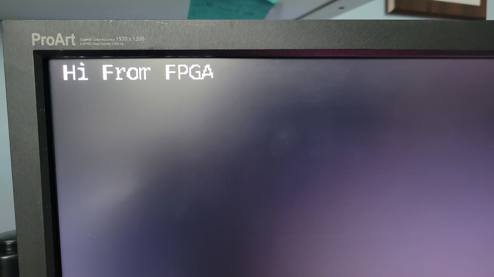

> **Incomplete:**
> While the code may be finished, this article is currently incomplete.
{:.prompt-warning}

Nearly three years ago, I designed a simple VGA controller for use with my [FPGA Pong game](https://jchisholm204.github.io/posts/vhdlPong/).
Now, I am redoing the project with the knowledge I gained from the past three years of digital design courses.

Additionally, my past VGA controller was only able to drive a color signal.
In this design redo, I have also included a font ROM and character buffer.
This allows any device (CPU or DMA) with memory access to display characters on the screen.

## The VGA Specification
I started this project by reviewing the VGA signal specification.
For my project, I chose to use the 640 x 480 @ 60 Hz VGA timing.
I chose this timing because it requires a 25.125 MHz signal that can be easily generated from the 50MHz clock signal available on the DE2 Development Board.
Granted, with a simple clock divisor, the signal will be 125 kHz off of the specification.
However, as seen in a later section, this amounts to minimal error in the signal timing.

The specifications for this timing are shown below ([source](http://www.tinyvga.com/vga-timing/640x480@60Hz)):

| Parameter           | Value        |
| ------------------- | ------------ |
| Screen refresh rate | 60 Hz        |
| Vertical refresh    | 31.46875 kHz |
| Pixel frequency     | 25.175 MHz   |

| Scanline Part  | Pixels | Time \[µs]          |
| -------------- | ------ | ------------------- |
| Visible area   | 640    | 25.422045680238     |
| Front porch    | 16     | 0.63555114200596    |
| Sync pulse     | 96     | 3.8133068520357     |
| Back porch     | 48     | 1.9066534260179     |
| **Whole line** | 800    | **31.777557100298** |

| Frame Part      | Lines | Time \[ms]          |
| --------------- | ----- | ------------------- |
| Visible area    | 480   | 15.253227408143     |
| Front porch     | 10    | 0.31777557100298    |
| Sync pulse      | 2     | 0.063555114200596   |
| Back porch      | 33    | 1.0486593843098     |
| **Whole frame** | 525   | **16.683217477656** |

## VGA Implementation
After reviewing the specification, I set to work developing my VGA module.

Based on the VGA specification, the following logic can be used to generate a VGA signal.

```verilog
module vga_controller(
    iClk_50, nRst,
    // Interfaces to VGA interface
    iRed, iBlue, iGreen,
    oRow, oCol,
    // Outputs to the VGA hardware
    oVGA_R,
    oVGA_G,
    oVGA_B,
    oVGA_Clk,
    oVGA_Blank,
    oVGA_HSync,
    oVGA_VSync,
    oVGA_Sync
);

input wire iClk_50, nRst;
// Interfaces to VGA interface
input wire  [9:0] iRed, iBlue, iGreen;
output wire [9:0] oRow, oCol;
// Outputs to the VGA hardware
output wire [9:0] oVGA_R, oVGA_G, oVGA_B;
output wire oVGA_Clk, oVGA_Blank, oVGA_HSync, oVGA_VSync, oVGA_Sync;

// Visible Area
parameter COL_VA = 10'd640;
// Front Porch
parameter COL_FP = 10'd16;
// Sync Pulse
parameter COL_SP = 10'd96;
// Back Porch
parameter COL_BP = 10'd48;
// Line Length
parameter COL_LN = (COL_VA + COL_FP + COL_SP + COL_BP);

parameter ROW_VA = 10'd480;
parameter ROW_FP = 10'd10;
parameter ROW_SP = 10'd2;
parameter ROW_BP = 10'd33;
parameter ROW_LN = (ROW_VA + ROW_FP + ROW_SP + ROW_BP);

// Signal Clock Counters
reg [9:0] row, col;

// Assign row and col outputs
assign oCol = col;
assign oRow = row;

// Clock Divider
reg Clk_25;
always @(posedge iClk_50, negedge nRst) begin
    if(~nRst) Clk_25 = 1'b0;
    else Clk_25 = ~Clk_25;
end

// Vertical and horizontal sync outputs
wire hSync, vSync;
assign hSync = col < (COL_VA + COL_FP) || col >= (COL_VA + COL_FP + COL_SP);
assign vSync = row < (ROW_VA + ROW_FP) || row >= (ROW_VA + ROW_FP + ROW_SP);
assign oVGA_HSync = hSync;
assign oVGA_VSync = vSync;
// VGA sync, blank and clock outputs
assign oVGA_Sync  = 1'b1;
assign oVGA_Blank = hSync & vSync;
assign oVGA_Clk = iClk_50;

// Visible Area
wire visible;
assign visible = (col < COL_VA) && (row < ROW_VA);

// Output Color
assign oVGA_R = visible ? iRed   : 10'd0;
assign oVGA_G = visible ? iGreen : 10'd0;
assign oVGA_B = visible ? iBlue  : 10'd0;

always @(posedge Clk_25 or negedge nRst) begin
    if(!nRst) begin
        row = 10'd0;
        col = 10'd0;
    end else begin
        if(col < (COL_LN-10'd1)) begin
            col = col + 10'd1;
        end else begin
            col = 10'd0;
            if(row < (ROW_LN-10'd1)) begin
                row = row + 10'd1;
            end else begin 
                row = 10'd0;
            end
        end
    end
end

endmodule
```
### Verification
For this project, rather than implementing proper signal timing verification using ModelSim or CoCoTB, I elected to verify the signal in hardware using a Selea logic analyzer.


As seen in the above analysis, the signal is nearly identical to the specification timings.
The signal was also verified by connecting the board to a monitor. (Shown below)

## Text Display
With a VGA signal generator created, the next step in this project was to create the text memory and display interface.

### Font ROM
The font ROM (Read Only Memory) contains the pixel data required to display characters on the screen.
The font ROM module is shown below:
```verilog
module font_rom(
    iChar,
    iRow,
    oLine
);

input wire [7:0] iChar;
input wire [3:0] iRow;
output wire [7:0] oLine;

reg [7:0] font_mem [0:4095];

initial begin
    $readmemh("font8x16.hex", font_mem);
end

assign oLine = font_mem[{iChar, iRow}];
```

The font hex file is generated using the following Python script.
This script was generated using ChatGPT to save on time.
Note that several small modifications needed to be made for this script to work properly.

```python
# WARNING
# This script was generated using ChatGPT
from PIL import Image, ImageFont, ImageDraw
import sys

FONT_PATH = "myFont.otf"
OUTPUT_PATH = "font8x16.hex"
CHAR_WIDTH = 8
CHAR_HEIGHT = 16

# Choose the ASCII range you want
CHAR_START = 0x20  # Space
CHAR_END   = 0x7F  # DEL (printable characters)

def reverse_bits(byte):
    return int('{:08b}'.format(byte)[::-1], 2)

def render_char_to_bitmap(font, char):
    img = Image.new("L", (CHAR_WIDTH, CHAR_HEIGHT), 0)
    draw = ImageDraw.Draw(img)
    draw.text((0, 0), char, fill=255, font=font)
    img = img.point(lambda x: 255 if x > 128 else 0, mode='1')  # Threshold to black/white
    return img

def main():
    try:
        font = ImageFont.truetype(FONT_PATH, CHAR_HEIGHT)
    except IOError:
        print(f"Failed to load font: {FONT_PATH}")
        sys.exit(1)

    hex_lines = []

    for code in range(256):  # Full ASCII range
        char = chr(code) if CHAR_START <= code <= CHAR_END else " "
        img = render_char_to_bitmap(font, char)
        cropped = img.crop((0, 0, CHAR_WIDTH, CHAR_HEIGHT))

        for y in range(CHAR_HEIGHT):
            row_bits = 0
            for x in range(CHAR_WIDTH):
                pixel = cropped.getpixel((x, y))
                if pixel:
                    row_bits |= (1 << (7 - x))  # Original MSB-left layout
            reversed_row = reverse_bits(row_bits)  # <-- Add this
            hex_lines.append(f"{reversed_row:02X}")

    with open(OUTPUT_PATH, "w") as f:
        f.write("\n".join(hex_lines))

    print(f"Wrote {len(hex_lines)} lines to {OUTPUT_PATH}")

if __name__ == "__main__":
    main()
```

### Frame Buffer
The Frame Buffer is a small chunk of memory dedicated to holding the characters currently being displayed on the screen.
Character data is converted to pixel data in real time using FPGA logic present in the main display module.

The frame buffer code is shown below:

```verilog
module frame_buffer(
    iClk, nRst, iWriteEn,
    iWAddr, iRAddr,
    iData, oData
);

input wire iClk, nRst, iWriteEn;
input wire [31:0] iWAddr, iRAddr;
input wire [31:0] iData;
output wire [31:0] oData;

localparam N = 2399;


reg [31:0] buffer [0:N];

assign oData = buffer[iRAddr];

always @(posedge iClk or negedge nRst) begin
    if(!nRst) begin
    end else begin
        if(iWriteEn) begin
            buffer[iWAddr] = iData;
        end
    end
end

endmodule
```

### Display Controller
The display controller is the top level module of the VGA controller.

It is shown below:
```verilog
module display(
    iClk_50, nRst,
    // Outputs to the VGA hardware
    oVGA_R,
    oVGA_G,
    oVGA_B,
    oVGA_Clk,
    oVGA_Blank,
    oVGA_HSync,
    oVGA_VSync,
    oVGA_Sync
);

input wire iClk_50, nRst;
// Outputs to the VGA hardware
output wire [9:0] oVGA_R, oVGA_G, oVGA_B;
output wire oVGA_Clk, oVGA_Blank, oVGA_HSync, oVGA_VSync, oVGA_Sync;

reg [9:0] R, G, B;
wire [9:0] row, col;


vga_controller vga(
    .iClk_50(iClk_50), 
    .nRst(nRst),
    // Interfaces to VGA interface
    .iRed(R),
    .iGreen(G),
    .iBlue(B),
    .oRow(row),
    .oCol(col),
    // Outputs to the VGA hardware
    .oVGA_R(oVGA_R),
    .oVGA_G(oVGA_G),
    .oVGA_B(oVGA_B),
    .oVGA_Clk(oVGA_Clk),
    .oVGA_Blank(oVGA_Blank),
    .oVGA_HSync(oVGA_HSync),
    .oVGA_VSync(oVGA_VSync),
    .oVGA_Sync(oVGA_Sync)
);

wire [7:0] line;
reg [7:0] char;
wire [31:0] buffer_data;

font_rom fonts(
    .iChar(char),
    .iRow(row[3:0]),
    .oLine(line)
);

frame_buffer buffer(
    .iClk(iClk_50),
    .nRst(nRst),
    .iWriteEn(1'b0),
    .iWAddr(32'd0),
    .iRAddr({19'd0, row[9:4], col[9:3]}),
    .iData(32'd0),
    .oData(buffer_data)
);

always @(posedge iClk_50) begin
    char = buffer_data[7:0];
    R = line[col[3:0]] ? {buffer_data[31:24], 2'b00} : 10'd0;
    G = line[col[3:0]] ? {buffer_data[23:16], 2'b00} : 10'd0;
    B = line[col[3:0]] ? {buffer_data[15:8],  2'b00} : 10'd0;
end

endmodule
```

## Results


The source is [https://github.com/Jchisholm204/Pantheon/tree/main/display](https://github.com/Jchisholm204/Pantheon/tree/main/display)
