## Introduction
Celebrating my first completed project as a new member of the Queen's Space Engineering Team (QSET): The Arm Control Board.
The objective of the Arm board is to act as an interface between the hardware of the arm and the ROS software that runs the rover. This includes interfacing with several limit switches, servos, and CAN-based motor controllers.

## Designing the PCB
This design contains several features including:
- 6 Debounced digital inputs
- 4 PWM connectors with 5V logic level shifting
- 2 CAN bus connectors
- 4 Load switched 5V power connectors
- 1 DC Motor driver circuit
- 1 USB type C device interface
- 2 USART connections

<!-- 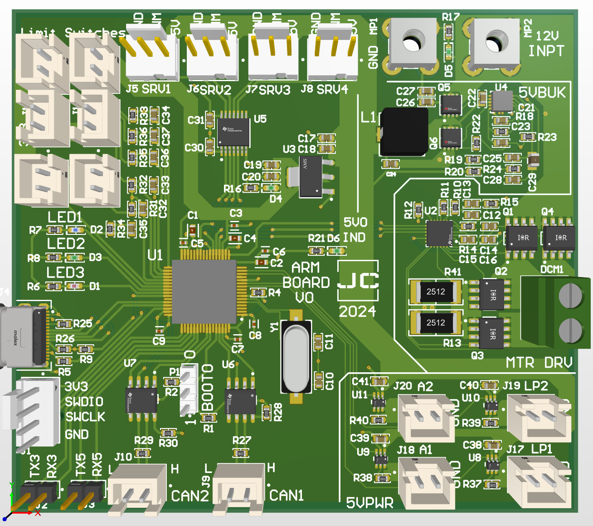 -->

  

### Digital Inputs
The arm board contains six digital inputs for limit switches used during the homing sequence.
Each input is individually debounced and routed into a digital input pin on the MCU.
In addition to debouncing the input, the circuit also acts as pull down, ensuring that no undefined behavior can occur during normal operation.

Additionally, note that each limit switch is supplied with a 3.3V signaling voltage.
Each limit switch is rated for a maximum input of 3.3V, powering one of these pins with a higher voltage risks damage to the MCU.

  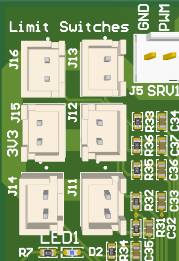

<!--  -->

### PWM Connectors
The board also provides four PWM outputs for 5V servo connections.
Each servo header is connected into 5V power and is logic level shifted to ensure compatibility with most servos.
Additionally, the logic level shifter requires a software driven pull-up for normal operation.
Failure to set the pull-up in software will cause the PWM outputs to be disabled.

<!-- 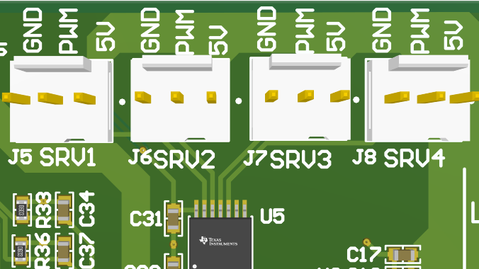 -->

  

### Load Switches
The arm has various tooling attachments requiring 5V power. 
Each 5V output is load switched and capable of handling a 2A load.

  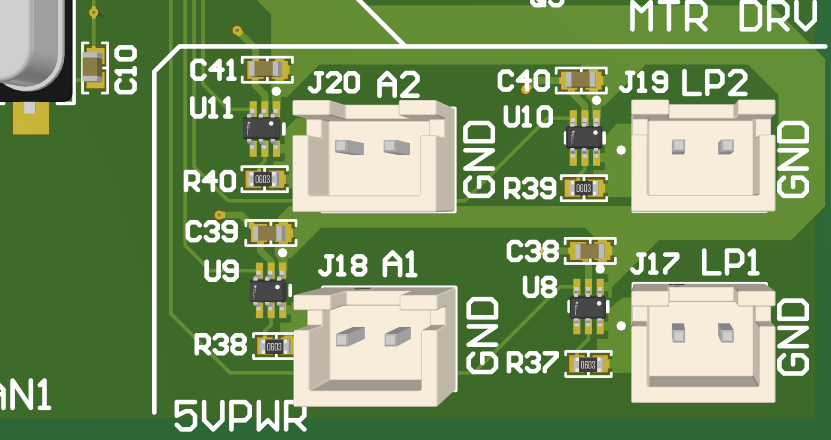

<!--  -->

### The MCU
Like most of my recent projects, an STM32F446 is used at the heart of the design.
See the schematics and PCB screenshots shown below, illustrating the USB and CAN bus connectivity.

  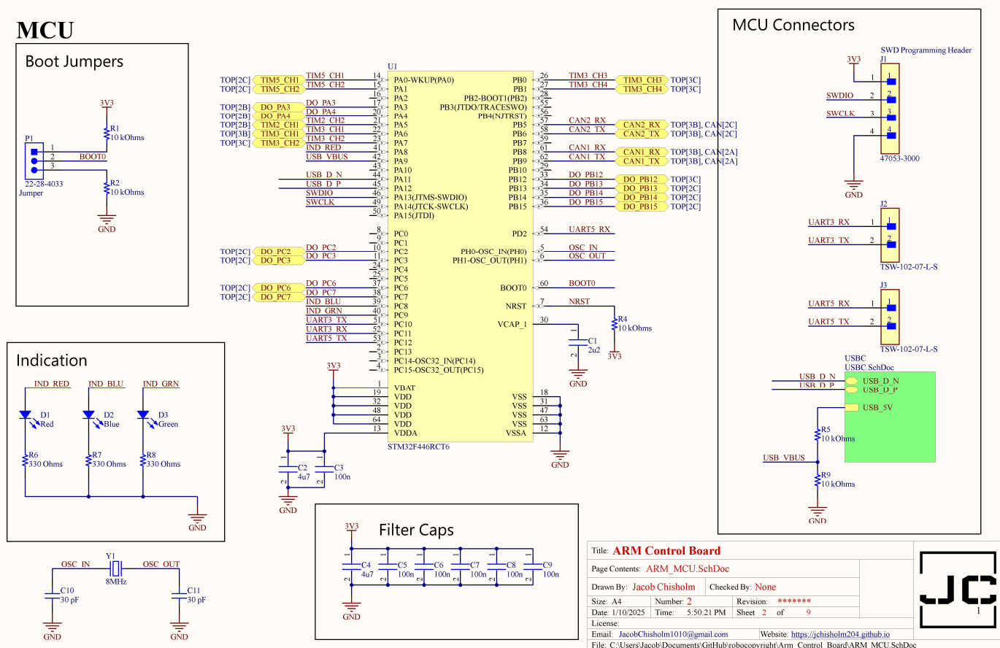
  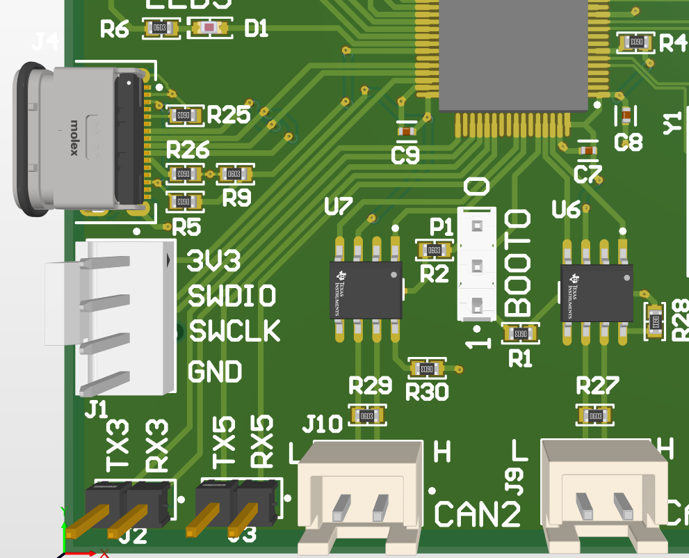

### Final Design
Design files are available on my [PCB GitHub Repository](https://github.com/Jchisholm204/robocopyright/tree/main/Arm_Control_Board).
This design is free to use and modify. If reusing this design, please provide credit in the appropriate places.

  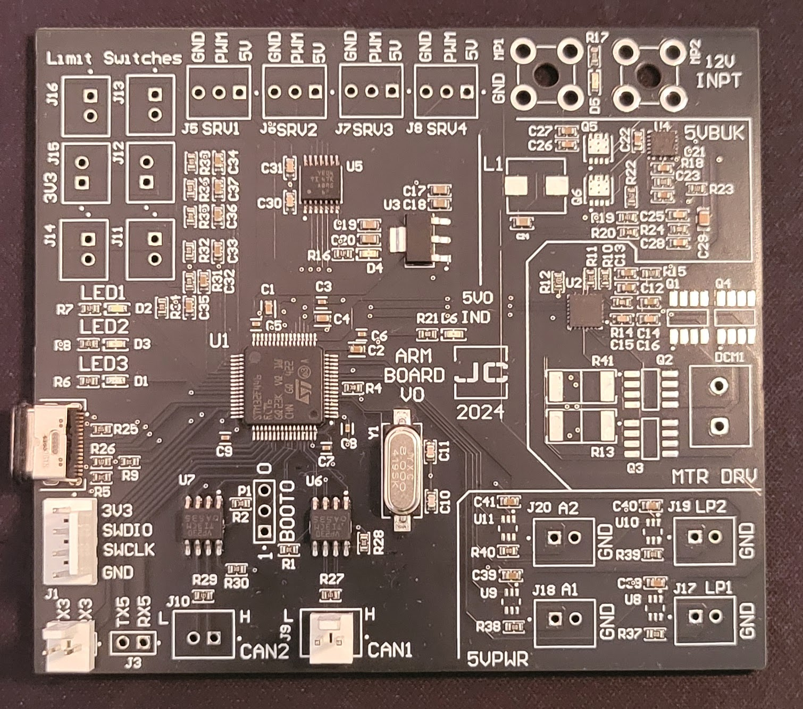
  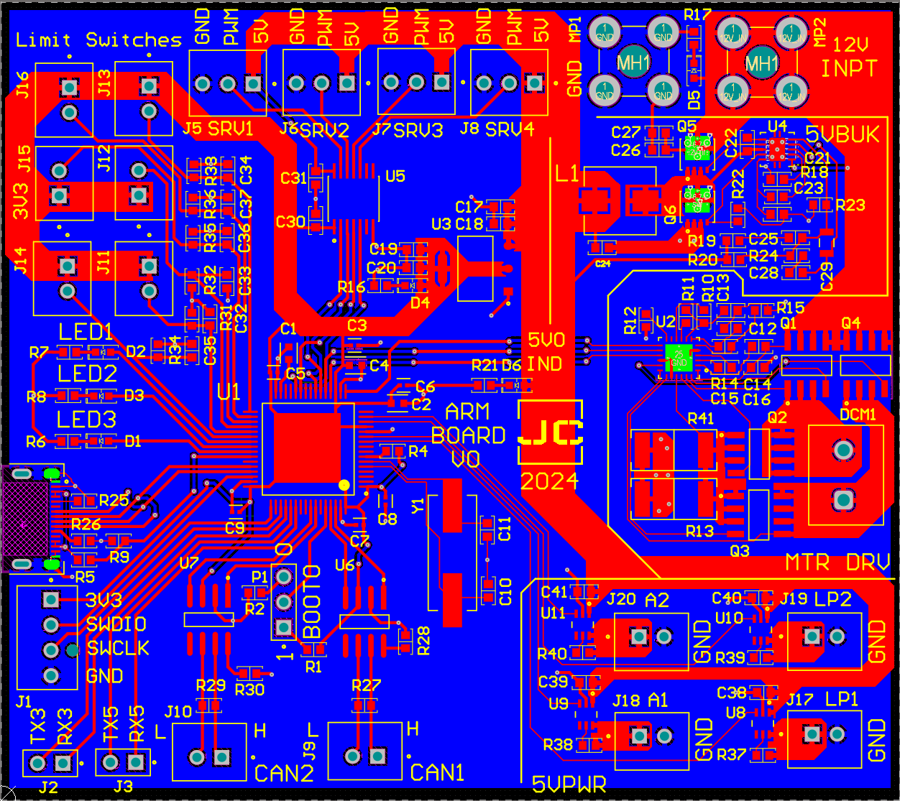

<!--  -->

## Testing
After receiving the board, all functionality was verified through software testing.
However, when testing several faults were revealed.

### Known/Fixed PWM Issues
When attempting to test the PWM functionality, it quickly became apparent that the PWM enable pin was not mapped to any MCU pin.
This resulted in PWM signals being present on the 3.3V side of the logic level shifter, but open lines on the 5V side.
In the current iteration of the board, this issue was fixed by connecting a wire from the output enable pin on the shifter to the UART 5 TX pin.
See the image below for how this was implemented.

  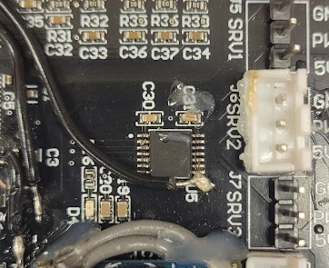
  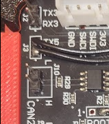

### Known Buck Regulator Issue
The Buck Regulator used in this design was a synchronous switching buck regulator copied from TI WebBench.
The decision to use this design was made to meet the deadline of creating this board.
However, the controller purchased from TI was either Dead on Arrival (DOA) or was configured incorrectly.
Thus causing the buck regulator to fail.

In testing, it was discovered that the buck failed to correctly regulate the output, providing approximately 0.35V to the 5V bus.
Thus the TI synchronous regulator was replaced with a 12V to 5V buck I happened to have on hand.

  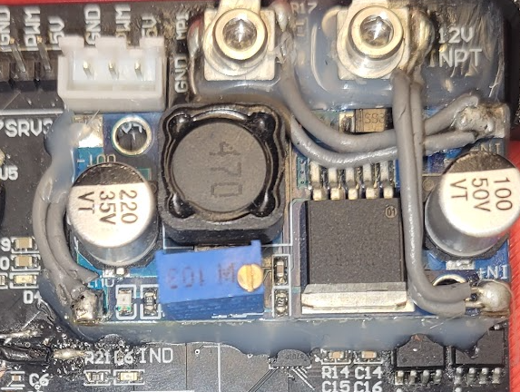

To implement the fix, the old synchronous regulator was first removed.
This included removing all components with the exception of the output filtering capacitors.
Then, the input of the new regulator was soldered into the screw terminals.
Finally, the output line of the new regulator was connected into the output side of the original inductor.

### Known/Fixed Motor Driver Issues
In the rush of completing the schematic, one of the PWM control signals was swapped with the enable signal.
This resulted in the motor driver being able to power the motor in one direction, but not the other.
To correct this issue, both the PWM trace and enable trace were severed.
After removing the silkscreen, the copper trace was exposed and wires were soldered into the lines.
The implemented fix is shown below in the image on the left.

  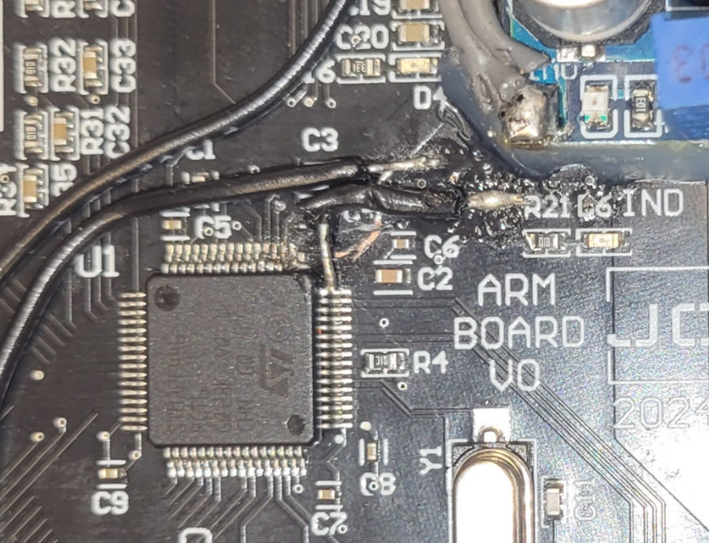
  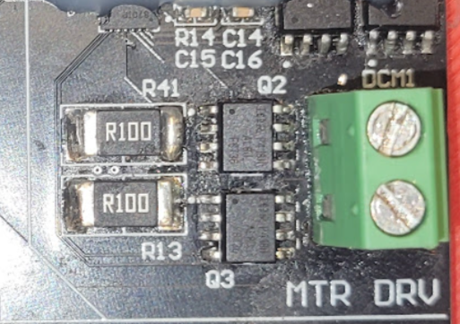

As seen in the above image, the PWM line was attached to into the MCU pin.
Then, the enable line was connected onto the exposed UART 5 RX pad.

In addition to the PWM and enable signals being swapped, the motor driver schematic was copied from the standard layout available on its datasheet.
This resulted in the current limit being set too low to handle the inrush current of the claw motor.
To fix this issue, the resistors depicted in the image above on the right, were removed and replaced with small pieces of metal.
This effectively created a zero ohm resistance, bypassing the controllers current sensing and therefore its current control.

Please note that **I do not recommend doing this as it could be considered unsafe.**
However, all components in this design are rated to handle up to 10A.
Furthermore when testing the motor, it was found to only have an inrush current of 6A.

### Load Switch Modifications
When testing the load switched power terminals, no failures were found.
However, after the completion of the board, I was notified that the team preferred always on outputs for this type of power port.
Thus, against my better judgement, the load switches were removed and replaced with soldered connections.
See below for how this modification was implemented.

  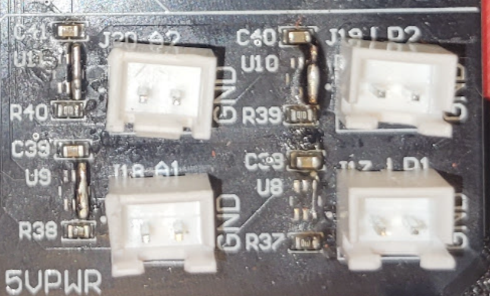
  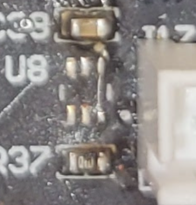

## Conclusion
Despite all of its flaws, this board remained an excellent learning opportunity.
Furthermore, after the aforementioned modifications, the board performs as originally expected.

Now that this board has been completed, I will continue working with the team to develop FreeRTOS-based firmware, allowing the board to be controlled over a custom USB CDC interface.